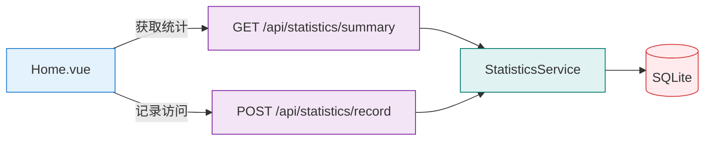

# 任务：添加统计工具功能

## 1. 需求概述
在 Home.vue 首页添加一个新的统计工具卡片，实时显示：
- 使用该工具的总人数（用户数）
- 访问页面的总次数（页面访问量）

## 2. 技术方案

### 2.1 技术选型
- **后端**：FastAPI + SQLite（延续现有技术栈）
- **前端**：Vue 3 + TypeScript（延续现有技术栈）
- **选型理由**：与现有架构保持一致，无需额外依赖

### 2.2 数据库设计

#### statistics 表（访问统计表）
```sql
CREATE TABLE statistics (
    id INTEGER PRIMARY KEY AUTOINCREMENT,
    ip_address VARCHAR(50),      -- 访问IP
    user_agent TEXT,             -- 用户代理
    visit_count INTEGER DEFAULT 1,  -- 访问次数
    first_visit TIMESTAMP DEFAULT CURRENT_TIMESTAMP,  -- 首次访问时间
    last_visit TIMESTAMP DEFAULT CURRENT_TIMESTAMP   -- 最后访问时间
);
```

**索引设计**：
- 在 `ip_address` 上创建索引，用于快速查找用户

### 2.3 架构设计



### 2.4 接口设计

#### API 1: 获取统计数据
- **路径**：`GET /api/statistics/summary`
- **说明**：获取当前统计数据
- **响应示例**：
```json
{
  "success": true,
  "data": {
    "total_users": 100,
    "total_visits": 250,
    "last_updated": "2026-01-26T10:30:00"
  }
}
```

#### API 2: 记录访问
- **路径**：`POST /api/statistics/record`
- **说明**：记录一次页面访问
- **请求头**：
  - `X-Real-IP` / `X-Forwarded-For`：真实IP
  - `User-Agent`：用户代理
- **响应示例**：
```json
{
  "success": true,
  "message": "访问记录成功"
}
```

## 3. 任务分解
- [ ] 子任务1：创建统计数据模型 (预计时间: 0.5h)
- [ ] 子任务2：创建统计Schema (预计时间: 0.5h)
- [ ] 子任务3：实现统计Service (预计时间: 1h)
- [ ] 子任务4：实现统计API (预计时间: 1h)
- [ ] 子任务5：前端API封装 (预计时间: 0.5h)
- [ ] 子任务6：Home.vue新增统计卡片 (预计时间: 1h)
- [ ] 子任务7：测试验证 (预计时间: 0.5h)

## 4. 前置研究
- [ ] 研究SQLite唯一索引去重逻辑
- [ ] 研究如何正确获取客户端IP地址

## 5. 风险评估
| 风险 | 影响 | 概率 | 应对措施 |
|------|------|------|----------|
| IP地址获取不准确 | 中 | 中 | 使用多种方式获取IP（X-Forwarded-For, X-Real-IP, Remote-Addr） |
| 统计数据刷量 | 低 | 低 | 暂不限制，仅做基础统计 |
| 数据库表结构变更 | 低 | 低 | 使用SQLite，便于迁移 |

## 6. 扩展性说明
- **水平扩展**：统计逻辑简单，无需特殊处理
- **功能扩展**：可扩展为按天/周/月统计趋势
- **数据扩展**：可添加更多统计维度（如使用的工具类型）

## 7. 进度跟踪
| 子任务 | 状态 | 完成时间 | Commit Hash |
|--------|------|----------|-------------|
| 子任务1 | 📋 待开始 | - | - |
| 子任务2 | 📋 待开始 | - | - |
| 子任务3 | 📋 待开始 | - | - |
| 子任务4 | 📋 待开始 | - | - |
| 子任务5 | 📋 待开始 | - | - |
| 子任务6 | 📋 待开始 | - | - |
| 子任务7 | 📋 待开始 | - | - |

## 8. 相关文档
- API 文档：自动生成于 /docs
- 设计文档：.clinerules/tasks/前后端分离重构设计.md
