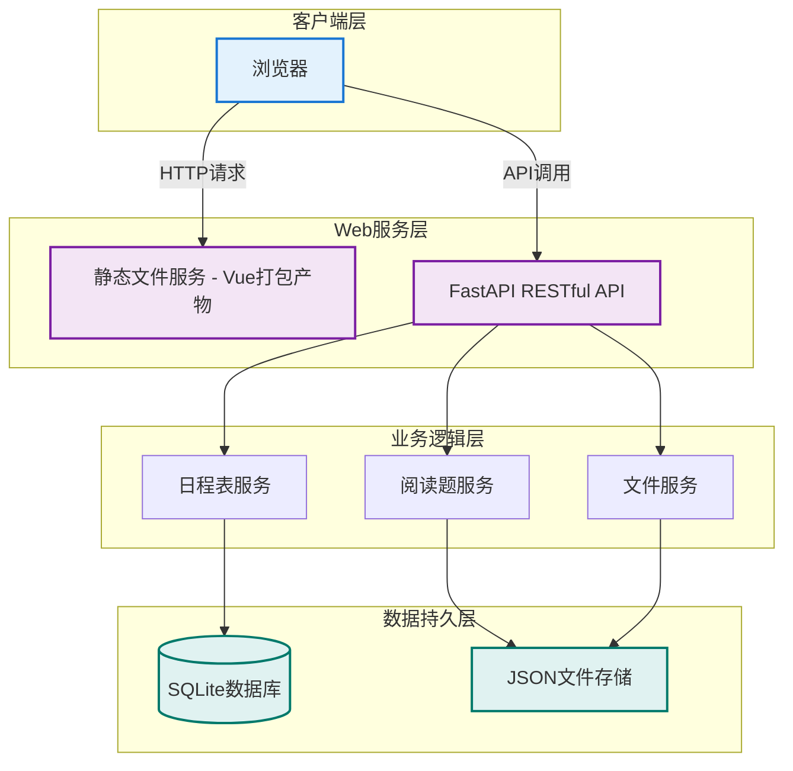
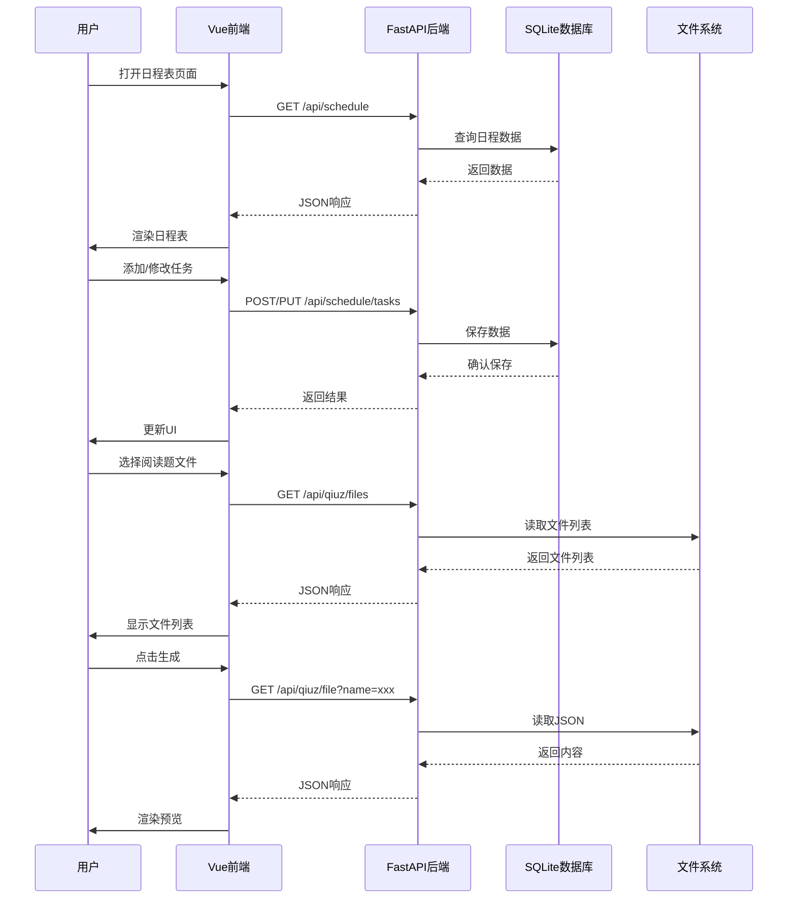
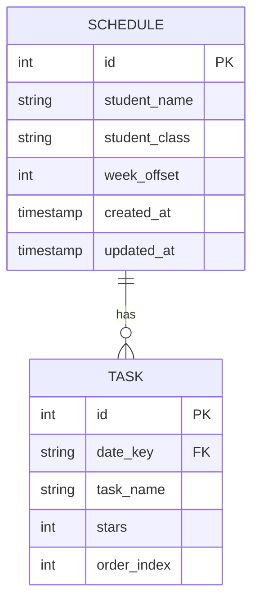

# 前后端分离重构技术设计方案

## 1. 项目概述

### 1.1 业务背景
将现有的假期工具集应用（假期每日任务日程表、阅读题生成器）从 Node.js + 纯HTML前后端不分离架构，重构为前后端分离架构。

### 1.2 重构目标
- **后端**：Python 3.13 + FastAPI + SQLite，提供 RESTful API
- **前端**：Vue 3 + TypeScript + Vite + Element Plus
- **部署**：后端统一服务，打包后的前端静态文件由后端托管
- **数据**：日程表数据迁移到SQLite，阅读题JSON文件继续存储

### 1.3 成功标准
- 所有现有功能完整迁移
- 前后端完全分离，API接口规范
- 代码结构清晰，易于扩展维护
- 部署简单，单启动命令

---

## 2. 技术选型

### 2.1 后端技术栈

| 技术 | 版本 | 选型理由 |
|------|------|----------|
| Python | 3.13 | 最新稳定版，性能优化 |
| FastAPI | 0.104+ | 异步高性能、自动API文档、类型注解 |
| Uvicorn | 0.24+ | ASGI服务器，支持异步 |
| Pydantic | 2.5+ | 数据验证，与FastAPI深度集成 |
| SQLite | 3.x | 轻量级、无需额外数据库服务 |
| SQLAlchemy | 2.0+ | Python标准ORM，支持SQLite |

### 2.2 前端技术栈

| 技术 | 版本 | 选型理由 |
|------|------|----------|
| Vue | 3.4+ | 最新版，组合式API |
| TypeScript | 5.3+ | 类型安全 |
| Vite | 5.0+ | 快速构建、热更新 |
| Element Plus | 2.4+ | Vue 3组件库 |
| Pinia | 2.1+ | Vue官方状态管理 |
| Vue Router | 4.2+ | 官方路由 |
| Axios | 1.6+ | HTTP客户端 |

### 2.3 开发工具
- 前端：Node.js 18+
- 代码规范：ESLint + Prettier
- Git：版本控制

---

## 3. 系统架构设计

### 3.1 整体架构图



### 3.2 目录结构设计

```
cynthia-study/
├── backend/                    # 后端项目
│   ├── app/
│   │   ├── __init__.py
│   │   ├── main.py            # FastAPI应用入口
│   │   ├── config.py          # 配置
│   │   ├── database.py        # 数据库连接
│   │   ├── models/            # SQLAlchemy模型
│   │   │   ├── __init__.py
│   │   │   ├── schedule.py
│   │   ├── schemas/           # Pydantic模型
│   │   │   ├── __init__.py
│   │   │   ├── schedule.py
│   │   │   ├── quiz.py
│   │   ├── api/               # API路由
│   │   │   ├── __init__.py
│   │   │   ├── schedule.py
│   │   │   ├── quiz.py
│   │   │   └── health.py
│   │   ├── services/          # 业务逻辑
│   │   │   ├── __init__.py
│   │   │   ├── schedule_service.py
│   │   │   └── quiz_service.py
│   │   └── utils/             # 工具函数
│   │       ├── __init__.py
│   │       └── file_helper.py
│   ├── data/                  # 数据存储目录
│   │   ├── cynthia.db         # SQLite数据库
│   │   └── quizzes/           # JSON阅读题文件
│   ├── requirements.txt
│   ├── .env.example
│   └── README.md
│
├── frontend/                   # 前端项目
│   ├── src/
│   │   ├── main.ts            # Vue入口
│   │   ├── App.vue            # 根组件
│   │   ├── api/               # API调用
│   │   │   ├── index.ts
│   │   │   ├── schedule.ts
│   │   │   └── quiz.ts
│   │   ├── stores/            # Pinia状态
│   │   │   ├── schedule.ts
│   │   │   └── quiz.ts
│   │   ├── views/             # 页面组件
│   │   │   ├── Home.vue
│   │   │   ├── Schedule.vue
│   │   │   └── QuizGenerator.vue
│   │   ├── components/        # 通用组件
│   │   │   └── ...
│   │   ├── router/            # 路由配置
│   │   │   └── index.ts
│   │   ├── types/             # TypeScript类型
│   │   │   └── index.ts
│   │   └── assets/            # 静态资源
│   ├── public/
│   ├── index.html
│   ├── vite.config.ts
│   ├── tsconfig.json
│   ├── package.json
│   └── README.md
│
├── @read/                      # 旧数据目录（迁移后可删除）
├── scripts/                    # 构建和部署脚本
│   ├── build.sh
│   └── start.sh
├── docker-compose.yml          # Docker部署（可选）
├── .gitignore
└── README.md
```

### 3.3 数据流设计



---

## 4. API 设计

### 4.1 API 规范

- **协议**: HTTP/1.1
- **数据格式**: JSON
- **编码**: UTF-8
- **基础路径**: `/api`
- **自动文档**: `/docs` (Swagger UI), `/redoc`

### 4.2 API 端点列表

#### 健康检查
| 方法 | 路径 | 说明 |
|------|------|------|
| GET | `/health` | 服务健康状态 |

#### 日程表管理
| 方法 | 路径 | 说明 |
|------|------|------|
| GET | `/api/schedule` | 获取日程表数据 |
| POST | `/api/schedule` | 创建/更新日程表 |
| POST | `/api/schedule/tasks` | 添加/更新任务 |
| DELETE | `/api/schedule/tasks/{id}` | 删除任务 |
| DELETE | `/api/schedule` | 清空所有数据 |

#### 阅读题管理
| 方法 | 路径 | 说明 |
|------|------|------|
| GET | `/api/quiz/files` | 获取JSON文件列表 |
| GET | `/api/quiz/file` | 获取单个文件内容 |
| POST | `/api/quiz/upload` | 上传JSON文件 |
| POST | `/api/quiz/save` | 保存JSON文件 |

### 4.3 API 响应格式

**成功响应:**
```json
{
  "success": true,
  "data": { ... },
  "message": "操作成功"
}
```

**错误响应:**
```json
{
  "success": false,
  "error": "错误描述",
  "code": "ERROR_CODE"
}
```

### 4.4 核心API详细设计

#### 4.4.1 日程表相关

**GET /api/schedule**
```
响应:
{
  "success": true,
  "data": {
    "student_name": "张三",
    "student_class": "初一(2)班",
    "week_offset": 0,
    "weekly_tasks": {
      "2024-01-22": {
        "tasks": [
          { "id": 1, "name": "晨读", "stars": 5 },
          { "id": 2, "name": "完成作业", "stars": 0 }
        ]
      }
    }
  }
}
```

**POST /api/schedule**
```
请求体:
{
  "student_name": "张三",
  "student_class": "初一(2)班",
  "week_offset": 0,
  "weekly_tasks": { ... }
}

响应:
{
  "success": true,
  "message": "日程表保存成功"
}
```

#### 4.4.2 阅读题相关

**GET /api/quiz/files**
```
响应:
{
  "success": true,
  "data": {
    "files": [
      {
        "name": "会跳舞的长袜子_20240122_abc123.json",
        "size": 3312,
        "modified": "2024-01-22T10:30:00"
      }
    ]
  }
}
```

**POST /api/quiz/save**
```
请求体:
{
  "title": "阅读题标题",
  "subtitle": "副标题",
  "sections": [ ... ]
}

响应:
{
  "success": true,
  "data": {
    "filename": "标题_20240122_def456.json",
    "path": "/data/quizzes/标题_20240122_def456.json"
  },
  "message": "文件保存成功"
}
```

---

## 5. 数据库设计

### 5.1 数据库类型
SQLite 3，单文件存储 `data/cynthia.db`

### 5.2 数据表设计

#### schedule 表（日程表基本信息）
```sql
CREATE TABLE schedule (
    id INTEGER PRIMARY KEY AUTOINCREMENT,
    student_name VARCHAR(50) NOT NULL,
    student_class VARCHAR(50),
    week_offset INTEGER DEFAULT 0,
    created_at TIMESTAMP DEFAULT CURRENT_TIMESTAMP,
    updated_at TIMESTAMP DEFAULT CURRENT_TIMESTAMP
);
```

#### task 表（日常任务）
```sql
CREATE TABLE task (
    id INTEGER PRIMARY KEY AUTOINCREMENT,
    date_key VARCHAR(20) NOT NULL,  -- 格式: YYYY-MM-DD
    task_name VARCHAR(200) NOT NULL,
    stars INTEGER DEFAULT 0,
    order_index INTEGER DEFAULT 0,
    UNIQUE(date_key, task_name, order_index)
);
```

### 5.3 ER图



---

## 6. 前端设计

### 6.1 页面结构

```
App.vue
├── 首页
├── 日程表管理
│   ├── 学生信息输入
│   ├── 周次选择
│   ├── 每日任务卡片
│   └── 打印功能
└── 阅读题生成器
    ├── 文件选择（从项目/本地上传）
    ├── JSON预览
    ├── HTML生成
    └── 下载功能
```

### 6.2 路由设计

| 路径 | 组件 | 说明 |
|------|------|------|
| `/` | `Home.vue` | 首页 - 工具卡片入口 |
| `/schedule` | `Schedule.vue` | 日程表管理 |
| `/quiz` | `QuizGenerator.vue` | 阅读题生成器 |

### 6.3 状态管理

使用 Pinia 管理状态：

**schedule.ts**
```typescript
export const useScheduleStore = defineStore('schedule', {
  state: () => ({
    studentName: '',
    studentClass: '',
    weekOffset: 0,
    weeklyTasks: {} as WeeklyTasks
  }),
  actions: {
    async loadSchedule() { ... },
    async saveSchedule() { ... },
    async updateTask(task: Task) { ... }
  }
})
```

### 6.4 UI组件库
- **Element Plus** 提供常用组件（按钮、表单、表格、卡片等）
- 保持原有设计风格（紫色渐变背景、圆角卡片）

---

## 7. 实施计划

### 7.1 任务分解

| 阶段 | 任务 | 预计时间 |
|------|------|----------|
| **阶段1：后端基础** | 创建FastAPI项目结构 | 1h |
| | 配置SQLite数据库 | 0.5h |
| | 实现健康检查API | 0.5h |
| **阶段2：日程表后端** | 实现日程表数据模型 | 1h |
| | 实现日程表API端点 | 2h |
| | 单元测试 | 1h |
| **阶段3：阅读题后端** | 实现文件服务 | 1h |
| | 实现阅读题API端点 | 1.5h |
| **阶段4：前端基础** | 创建Vue3项目 | 0.5h |
| | 配置路由和状态管理 | 1h |
| **阶段5：页面实现** | 实现首页 | 1h |
| | 实现日程表页面 | 3h |
| | 实现阅读题生成器页面 | 3h |
| **阶段6：集成测试** | 前后端联调测试 | 2h |
| | 功能完整性验证 | 1h |
| **阶段7：部署交付** | 编写部署文档 | 0.5h |
| | 更新README | 0.5h |

**总计**: 约 20 小时

### 7.2 分阶段交付

1. **MVP阶段**: 后端API + 简单前端框架
2. **功能阶段**: 完整功能实现
3. **优化阶段**: 样式优化、错误处理

---

## 8. 风险评估

| 风险 | 影响 | 概率 | 应对措施 |
|------|------|------|----------|
| 数据迁移丢失 | 高 | 低 | 保留原文件，备份后再迁移 |
| 前后端兼容性问题 | 中 | 中 | 严格遵循API文档规范 |
| 部署复杂度增加 | 中 | 低 | 使用shell脚本简化启动 |
| Vue学习曲线 | 低 | 中 | 使用熟悉的组件库 |

---

## 9. 扩展性说明

### 9.1 水平扩展
- FastAPI支持异步，可轻松迁移到多进程部署
- SQLite可替换为MySQL/PostgreSQL
- 前端静态文件可托管到CDN

### 9.2 功能扩展
- 用户认证（JWT）
- 多用户数据隔离
- 阅读题模板库
- 数据导出功能

### 9.3 数据扩展
- 日程表：添加任务标签、提醒功能
- 阅读题：支持更多题型、智能批改

---

## 10. 部署方案

### 10.1 开发环境

```bash
# 后端启动
cd backend
python -m venv venv
source venv/bin/activate  # Windows: venv\Scripts\activate
pip install -r requirements.txt
uvicorn app.main:app --reload --port 8000

# 前端启动（开发模式）
cd frontend
npm install
npm run dev
```

### 10.2 生产环境

```bash
# 构建前端
cd frontend
npm run build

# 启动后端（自动服务前端静态文件）
cd backend
uvicorn app.main:app --host 0.0.0.0 --port 8000
```

### 10.3 统一启动脚本

创建 `start.sh`:
```bash
#!/bin/bash
cd backend
source venv/bin/activate
uvicorn app.main:app --host 0.0.0.0 --port 8000
```

---

## 11. 质量保障

### 11.1 代码规范
- Python: PEP 8, 类型注解
- TypeScript: ESLint + Prettier

### 11.2 测试覆盖
- 后端API单元测试: pytest
- 前端组件测试: Vitest

### 11.3 文档
- API自动文档: FastAPI /docs
- README: 使用说明
- 代码注释: 关键逻辑注释

---

## 12. 兼容性说明

### 12.1 后向兼容
- 保留 `@read` 目录，旧数据仍可访问
- API设计支持数据迁移脚本

### 12.2 浏览器支持
- Chrome 90+
- Edge 90+
- Firefox 88+
- Safari 14+

---

## 13. 总结

本设计方案将现有应用重构为前后端分离架构，采用 **FastAPI + SQLite + Vue3** 技术栈，具有以下优势：

✅ **架构清晰**: 前后端完全分离，职责明确
✅ **易于维护**: 模块化设计，代码结构规范
✅ **部署简单**: 单服务启动，无需额外配置
✅ **性能优化**: FastAPI异步处理，Vite快速构建
✅ **扩展性强**: 支持后续功能扩展和性能优化

项目实施预计需要 **20小时**，分为7个阶段逐步交付。
